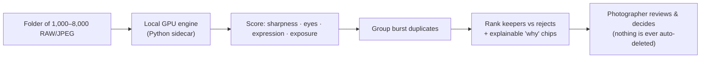

# CullPilot

> Cull a 1,000–8,000-photo shoot in about 30 minutes, on your own machine. Your clients' photos never leave it.

**Source is private by design** — this repo is a public showcase of the product and its architecture.

<!-- drop a screenshot of the keeper/reject grid here: assets/hero.png -->

---

## The problem
Culling a wedding or event shoot is a 3-6 hour chore: thousands of near-identical frames, and you have to find the sharp, eyes-open, best-expression keeper in every burst. The tools that help are either a yearly subscription or charge per photo and upload your clients' images to the cloud. For a private, on-site, once-in-a-lifetime shoot, that's a non-starter.

## What it does
Point CullPilot at a folder of 1,000-8,000 RAW/JPEG photos. On your own GPU it:
- **Scores every shot** — sharpness, eyes open/closed, expression, exposure.
- **Groups burst duplicates** so you compare like with like.
- **Ranks keepers vs rejects**, with explainable "why this rank" chips so you can trust it.
- Turns a 3-6 hour cull into a ~30-minute review. 100% local. Pay once, not a subscription.

## The cardinal rule: the AI suggests, the photographer decides
CullPilot **never auto-deletes** and is tuned so it **never buries a keeper** (a discarded keeper from a once-in-a-lifetime shoot is the unforgivable failure). It ranks and flags; you make every final call. Conservative by design.

## How it's built

## Tech
| Layer | Stack |
|---|---|
| UI | Electron + React + TypeScript |
| Engine | Python sidecar — RAW decode + GPU computer-vision scoring models |
| Runtime | 100% local, GPU-accelerated with CPU fallback. No cloud, no uploads. |

## Status
**v0.2, pre-launch.** Working desktop app (scoring, burst grouping, keeper/reject ranking, explainable chips, dark/light themes) plus a marketing site built and gate-green (Lighthouse 94/100/100/100). Sibling tool: FolderPilot.

---

Built by **Jesse Jolly** · [SFX Tech Innovation](https://sfxtechinnovation.com) · [LinkedIn](https://linkedin.com/in/jessegjolly)

*Source code is private and proprietary. This repository showcases the product and its architecture only.*
